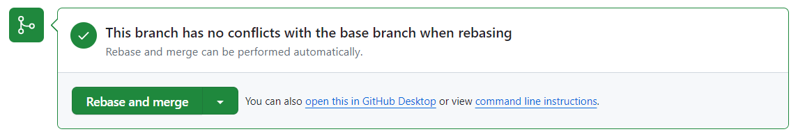

# DevOps Portal (DOPO)

2023 Hackathon project for Česká Spořitelna.

### Team members

- Václav Jochim
- Dominik Vít
- Petr Kratochvíl
- Lukáš Bajer

# Dev guide

Package manager: `yarn`

##### Environments

- Development (hot reloading): `yarn dev`

- Production: `yarn build` and then `yarn start`

## Imports

Please use absolute imports when importing code from a different folder. The root is configured to be `@/*`, for example:

```javascript
import ConfirmDialog from "@/components/ConfirmDialog";
import useAuth from "@/hooks/useAuth";
```

## Git

1. Use a rebase instead of merge to resolve conflicts to keep the history clean.

2. Please use a separate branch for your commits and create a pull request when you're done.
   Choose `Rebase and merge` option when merging the pull request.



##### branch names

- `feature/<feature-name>` for new features
- `update/<update-name>` for updating existing features
- `fix/<bug-name>` for bug fixes

##### commit messages

- `feature: <feature-name>`
- `update: <update-name>`
- `fix: <bug-name>`
